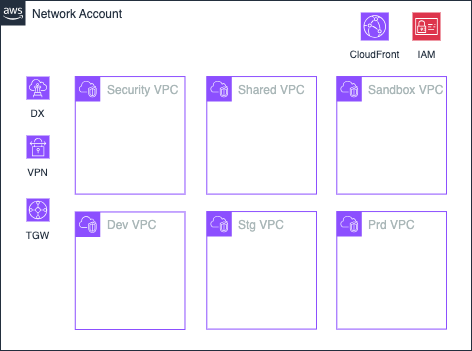

# Network Account

Network Account는 AWS Multi-Account 전략에서 조직의 네트워크 관리를 중앙화하고 보안 및 운영 효율성을 극대화하기 위해 설계된 계정입니다. 이 계정은 전사적 네트워크 트래픽을 관리하며, AWS 환경 내에서 네트워크 관련 리소스를 통합적으로 제어하는 역할을 합니다.

## Network Account의 주요 역할

1. 중앙화된 네트워크 관리
   - AWS Transit Gateway, VPC Peering, Direct Connect, Site to Site VPN 등을 통해 여러 계정간의 네트워크를 중앙에서 관리합니다.
   - 모든 네트워크 트래픽(인바운드 및 아웃바운드)은 Network Account를 통해 라우팅되며, 이를통해 트래픽 흐름을 제어하고 모니터링할 수 있습니다.
2. 리소스 공유
   - AWS Resource Access Manager(AWS RAM)을 활용해 VPC를 다른 계정과 공유합니다. 이를 통해 각 워크로드 계정이 중앙 네트워크 리소스를 효율적으로 사용할 수 있도록 지원합니다.
3. DNS 및 라우팅 관리
   - 중앙 집중식 DNS 관리를 통해 모든 계정에서 일관된 도메인 네임 확인이 가능하도록 지원합니다.
   - 라우팅 테이블을 설계하여 승인된 경로만 허용하고, 불필요한 East-West 트래픽을 차단합니다.

## Infrastructure



## Variables

```
# Generic Variables
region      = "ap-northeast-2"
service     = "test"
environment = "dev"
owners      = "user.email.com"
accounts = {
  "mgmt"    = "096090541966"
  "network" = "096090541652"
  "shared"  = "096090541481"
  "sandbox" = "096090540647"
  "dev"     = "096090541979"
  "stg"     = "096090541898"
  "prd"     = "096090542079"
}

# IAM Assumeable Role Variables
create_account_password_policy = true
account_alias                  = "test-dev"
create_iam_assumeable_role     = true

# Transit gateway Variables
create_tgw      = true

# Direct Connect Variables
create_dx_connection                = false
create_dx_gateway                   = false
create_dx_transit_virtual_interface = false
create_dx_gateway_association       = false

# Site to Site VPN Variables
create_vpn_connection = true
customer_gateway_bgp_asn = "65000"
customer_gateway_static_public_ip = "123.111.176.36"
vpn_connection_static_routes = ["100.0.0.1/32"]


# VPC Security Variables
create_vpc_security                = true
cidr_security                      = "10.13.208.0/22"
public_subnets_security            = ["10.13.209.0/26", "10.13.209.64/26"]
app_subnets_security               = ["10.13.208.0/25", "10.13.208.128/25"]
waf_subnets_security               = ["10.13.210.128/26", "10.13.210.192/26"]
endpoint_subnets_security          = ["10.13.209.128/26", "10.13.209.192/26"]
tgw_attach_subnets_security        = ["10.13.210.0/28", "10.13.210.16/28"]
enable_nat_gateway_security        = true
single_nat_gateway_security        = false
enable_vpc_flow_log_security       = true
vpc_flow_log_s3_arn_security       = "arn:aws:s3:::s3-test-mgmt-vpc-flow-log"

# VPC Shared Variables
create_vpc_shared                  = true
cidr_shared                        = "10.13.212.0/22"
elb_subnets_shared                 = ["10.13.213.0/27", "10.13.213.32/27"]
app_subnets_shared                 = ["10.13.212.0/25", "10.13.212.128/25"]
database_subnets_shared            = ["10.13.215.0/25", "10.13.215.128/25"]
endpoint_subnets_shared            = ["10.13.213.128/26", "10.13.213.192/26"]
tgw_attach_subnets_shared          = ["10.13.214.0/28", "10.13.214.16/28"]
enable_nat_gateway_shared          = false
single_nat_gateway_shared          = false
enable_vpc_flow_log_shared         = true
vpc_flow_log_s3_arn_shared         = "arn:aws:s3:::s3-test-mgmt-vpc-flow-log"

# VPC Dev Variables
create_vpc_dev                     = true
cidr_dev                           = "10.13.128.0/18"
elb_subnets_dev                    = ["10.13.161.128/27", "10.13.161.160/27"]
app_subnets_dev                    = ["10.13.128.0/20", "10.13.144.0/20"]
database_subnets_dev               = ["10.13.160.0/25", "10.13.160.128/25"]
endpoint_subnets_dev               = ["10.13.161.0/26", "10.13.161.64/26"]
tgw_attach_subnets_dev             = ["10.13.161.192/28", "10.13.161.208/28"]
enable_nat_gateway_dev             = false
single_nat_gateway_dev             = false
enable_vpc_flow_log_dev            = true
vpc_flow_log_s3_arn_dev            = "arn:aws:s3:::s3-test-mgmt-vpc-flow-log"

# VPC Sandbox Variables
create_vpc_sandbox                 = true
cidr_sandbox                       = "10.13.192.0/20"
elb_subnets_sandbox                = ["10.13.201.128/27", "10.13.201.160/27"]
app_subnets_sandbox                = ["10.13.192.0/22", "10.13.196.0/22"]
database_subnets_sandbox           = ["10.13.200.0/25", "10.13.200.128/25"]
endpoint_subnets_sandbox           = ["10.13.201.0/26", "10.13.201.64/26"]
tgw_attach_subnets_sandbox         = ["10.13.201.192/28", "10.13.201.208/28"]
enable_nat_gateway_sandbox         = false
single_nat_gateway_sandbox         = false
enable_vpc_flow_log_sandbox        = true
vpc_flow_log_s3_arn_sandbox        = "arn:aws:s3:::s3-test-mgmt-vpc-flow-log"

# VPC Prd Variables
create_vpc_prd                 = true
cidr_prd                       = "10.13.0.0/18"
elb_subnets_prd                = ["10.13.33.128/27", "10.13.33.160/27"]
app_subnets_prd                = ["10.13.0.0/20", "10.13.16.0/20"]
database_subnets_prd           = ["10.13.32.0/25", "10.13.32.128/25"]
endpoint_subnets_prd           = ["10.13.33.0/26", "10.13.33.64/26"]
tgw_attach_subnets_prd         = ["10.13.33.192/28", "10.13.33.208/28"]
enable_nat_gateway_prd         = false
single_nat_gateway_prd         = false
enable_vpc_flow_log_prd        = true
vpc_flow_log_s3_arn_prd        = "arn:aws:s3:::s3-test-mgmt-vpc-flow-log"

# VPC Stg Variables
create_vpc_stg                 = true
cidr_stg                       = "10.13.64.0/18"
elb_subnets_stg                = ["10.13.97.128/27", "10.13.97.160/27"]
app_subnets_stg                = ["10.13.64.0/20", "10.13.80.0/20"]
database_subnets_stg           = ["10.13.96.0/25", "10.13.96.128/25"]
endpoint_subnets_stg           = ["10.13.97.0/26", "10.13.97.64/26"]
tgw_attach_subnets_stg         = ["10.13.97.192/28", "10.13.97.208/28"]
enable_nat_gateway_stg         = false
single_nat_gateway_stg         = false
enable_vpc_flow_log_stg        = true
vpc_flow_log_s3_arn_stg        = "arn:aws:s3:::s3-test-mgmt-vpc-flow-log"

# CloudFront Variables
create_cloudfront = false
```
